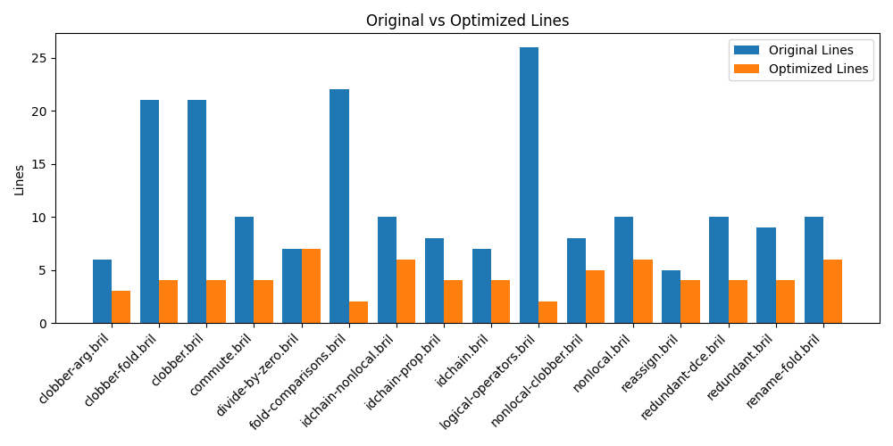
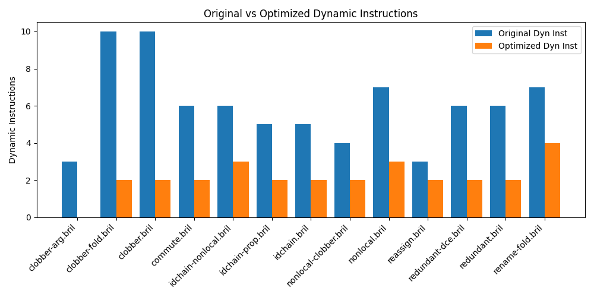

**Team Members**
Serena Zhang (syz8), Maggie Gao (mg2447), Jacqueline Wen (jw2347)

[Source code URL](https://github.com/Jacqueline-Wen/cs6120-AdvCompilers-Tasks/tree/main/Task3)

**Dead Code Elimination**

For the trivial implementation of dead code elimination, we supported two main functionalities: remove unused variables and remove variables that were reassigned before they were used. 

For removing variables that were unused, we created a map that tracked whether a variable was used, as well as a set that tracked all variables that were created. We then compared the set with the map and removed the unused variables. 

For removing unused variables that were reassigned, we created maps to track when variables were last assigned and last used. If we came across a variable assignment where the variable was previously assigned after it was used, we would remove the variable assignment.

For testing, we tested my implementation against some basic test casses. 

**Local Value Numbering**

We first implemented the pseudocode for local value numbering given in class. We then extended our LVN implementation to commutative operations, copy propagation, and constant folding. 

For commutative operations, we found all the operations where the order of arguments does not matter (`add`, `mul`, `eq`, `ne`, `and`, `or`). Then, whenever an instruction used one of these operations, we sorted the arguments. This means that our program will be able to recognize identical instructions are the same regardless of the order or arguments (ex. `add a b` is the same as `add b a`). 

For copy propagation, we identify instructions that simply copy a value from one variable to another, such as `b: int = id a `. When we encounter such an instruction, we replace all subsequent uses of the target variable with the source variable until the source is redefined. This eliminates the need for the intermediate variable and simplifies the code.

For constant folding, we built a const2var map which stores the numeric value for each variable that has been defined as or calculated to be a constant. For an instruction, if all arguments are found in this map, we can perform the computation at compile time. We have two dedicated helper functions for this: constant_folding_int for integer arithmetic operations (`add`, `sub`, `mul`, `div`) and constant_folding_bool for boolean and comparison operations (`not`, `eq`, `ne`, `lt`, `le`, `gt`, `ge`, `and`, `or`). If a computation is successful, the original instruction is replaced with a simple const instruction that assigns the calculated value to the destination variable. 

For all three extensions, we rely on dead code elimination to clean up any unnecessary code at the end. 

**Testing**

Our testing process involved both hand-crafted unit tests and automated benchmark evaluations to verify correctness and measure the effectiveness of our optimizations.

For our hand-crafted tests, we wrote small, focused Bril programs to test LVN (`lvn/tests`), DCE (`tdce/tests`), and the combined LVN + DCE pipeline (`tests/`). There programs were designed to target specific test cases, such as constant folding, repeated instructions, etc.

For a more comprehensive evaluation, we used Bril programs from the official Bril repository (`bril/examples/test/lvn/`), placed under `benchmark/tests`. We built a Python script to automatically run every one of these `.bril` programs in two configurations: the baseline (no optimizations) and optimized (LVN + DCE). This script measured both the static program size (line counts) and dynamic instruction counts. These results are stored in `lvn_results.json`.

To interpret these results more clearly, we also generated the bar charts below with `graph.py`.

**Hardest Part**

The hardest part was debugging. Debugging errors that occurred was tricky because Bril programs don’t provide detailed error traces. We often had to manually inspect various intermediate outputs to pinpoint the specific issue. Errors could occur at many different stages of the pipeline: parsing JSON inputs, in the LVN implementation, in the DCE logic, etc. For example, when the bug was in LVN, it was tricky to narrow down whether the problem came from copy propagation, handling of the "op" field, or value numbering itself. Because of this, debugging required a lot of careful trial and error, rerunning programs with slight variations, and checking outputs step by step.

**Michelin Star**

We believe our code deserves a michelin star. After wrestling with debugging and fixing various issues, we were able to implement LVN and DCE meticulously in C++. Furthermore, we not only implemented a trivial version of LVN and DCE. We extended our implementation to perform commutative operations, constant folding, and copy propogation.
