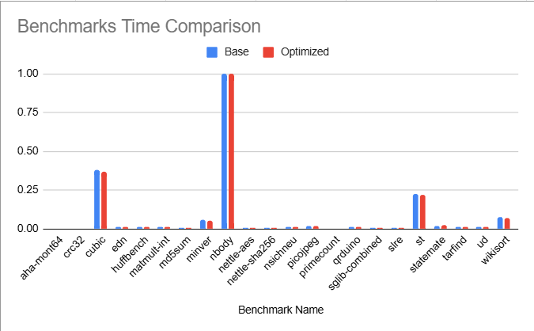

**Team Members**
Serena Zhang (syz8), Maggie Gao (mg2447), Jacqueline Wen (jw2347)

[Source code URL](https://github.com/Jacqueline-Wen/cs6120-AdvCompilers-Tasks/tree/main/Task8-LICM)

## Pass
For this assignment, we implemented LICM with LLVM. We noticed that LLVM had a lot of pre-built functions, such as `llvm::hasLoopInvariantOperands`, and we used this to make our lives a little easier. We implemented the LICM optimization as decribed on the website using the same skeleton as Task7. 

Working with LLVM for this assignment was pretty frustrating. Namely, we had to juggle dynamically casting between const and non-const instructions (honestly this is pretty terrible C++ coding) as some built in LLVM functions required the parameters to be const, while others did not.  

## Testing
To first sanity check our code, we write a simple C++ program and compared the intermediate representations with and without the pass. When we manually compared the intermediate representations, we noticed that the optimization was being implemented. 

To more rigorously test our code, we used embench. Here are our results:

| Comparison Type | aha-mont64 | crc32 | cubic | edn | huffbench | matmult-int | md5sum | minver | nbody | nettle-aes | nettle-sha256 | nsichneu | picojpeg | primecount | qrduino | sglib-combined | slre | st | statemate | tarfind | ud | wikisort |
|-----------------|-------------|--------|--------|-----|------------|--------------|--------|--------|--------|-------------|----------------|-----------|-----------|-------------|----------|-----------------|------|------|------------|----------|------|-----------|
| Original Speed  | 2.45 | 1.95 | 191.96 | 9.23 | 8.28 | 8.86 | 5.79 | 29.79 | 500.62 | 6.29 | 5.81 | 8.26 | 10.47 | 3.07 | 6.69 | 4.33 | 5.38 | 115.43 | 9.62 | 8.87 | 9.24 | 38.85 |
| Optimized Speed | 2.45 | 1.94 | 190.00 | 9.57 | 8.33 | 8.78 | 5.36 | 29.84 | 513.06 | 6.11 | 5.78 | 8.25 | 10.54 | 3.07 | 7.00 | 4.57 | 6.28 | 113.86 | 12.81 | 8.88 | 9.20 | 37.85 |

We also created a graph (with normalized values) to help visual the results:

It seems that we were able to speed up some of the programs with our LICM optimization. However, there are also many programs where the speed is unaffected or increased by the optimization. Overall, we observed no substantial results with embench. Perhaps more loop optimizations are necessary for obvious speedups in programs. 

## Hardest Part
The most challenging part of this assignment was trying to navigate the complexity of LLVM and understanding how its internal analyses interacted. While conceptually the LICM algorithm is straightforward, implementing it in LLVM required careful management. Another challenge was setting up and running Embench for testing. The documentation and benchmarking workflow was initially confusing and took a fair amount of time. However, after much trial and error, we were finally able to get Embench working and collect performance data to test our optimization.

## Michelin Star
We believe that we deserve a michelin start for completely the specification of this assignment. Although we didn't see a desirable outcome, we still learned a lot by completing this assignment. 